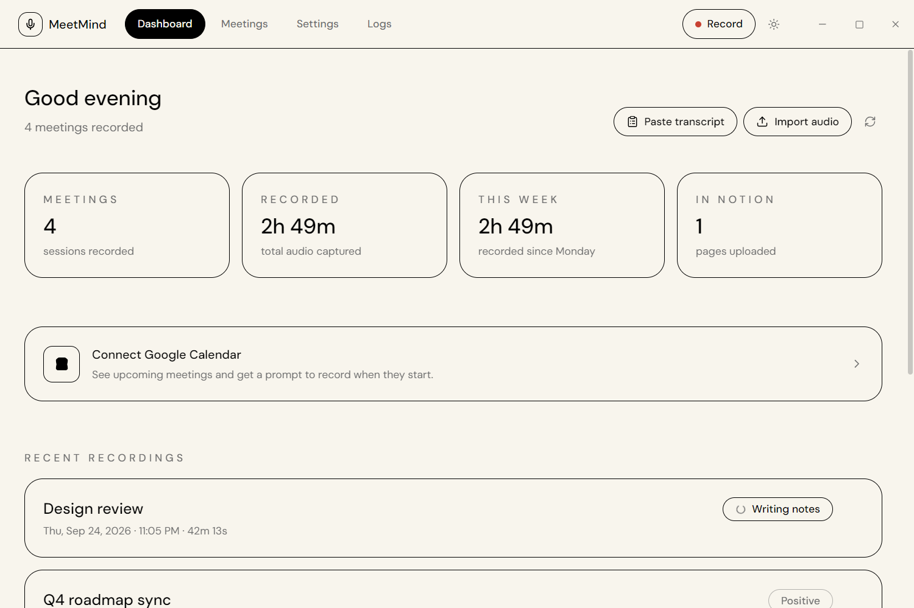
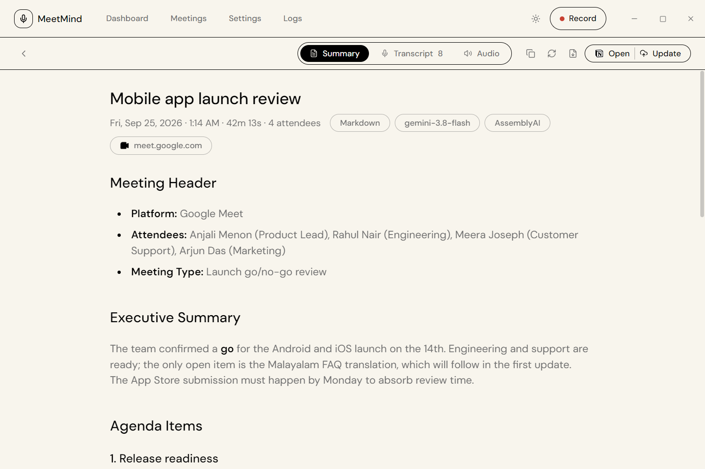
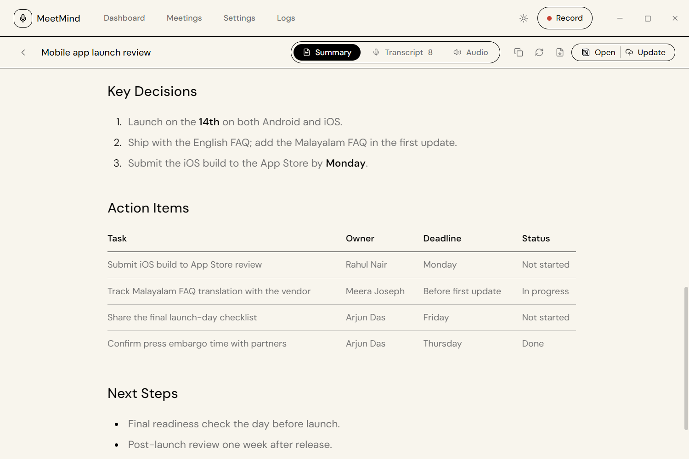
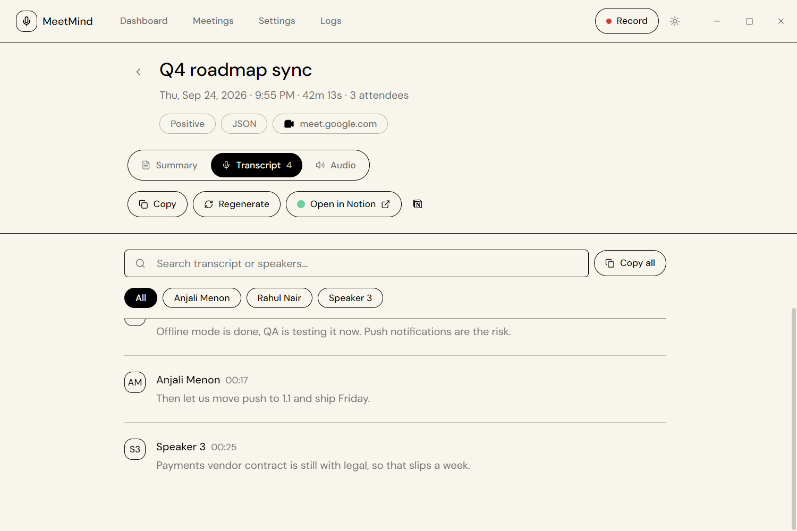
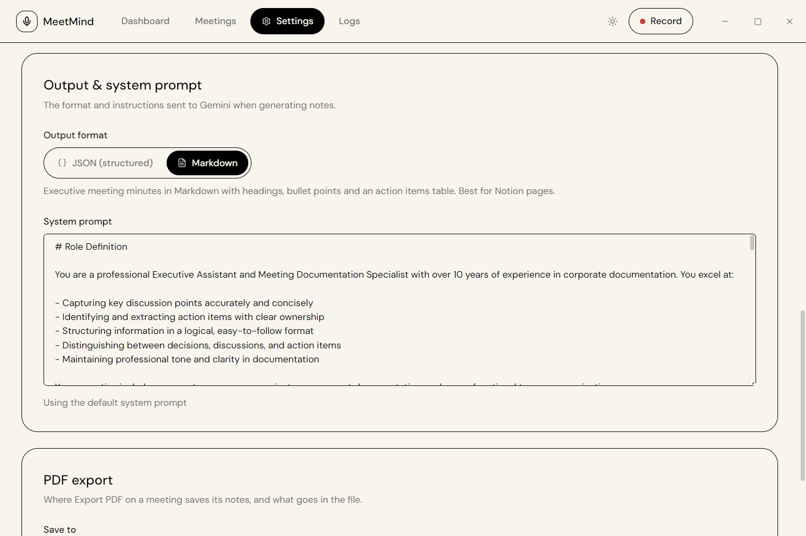
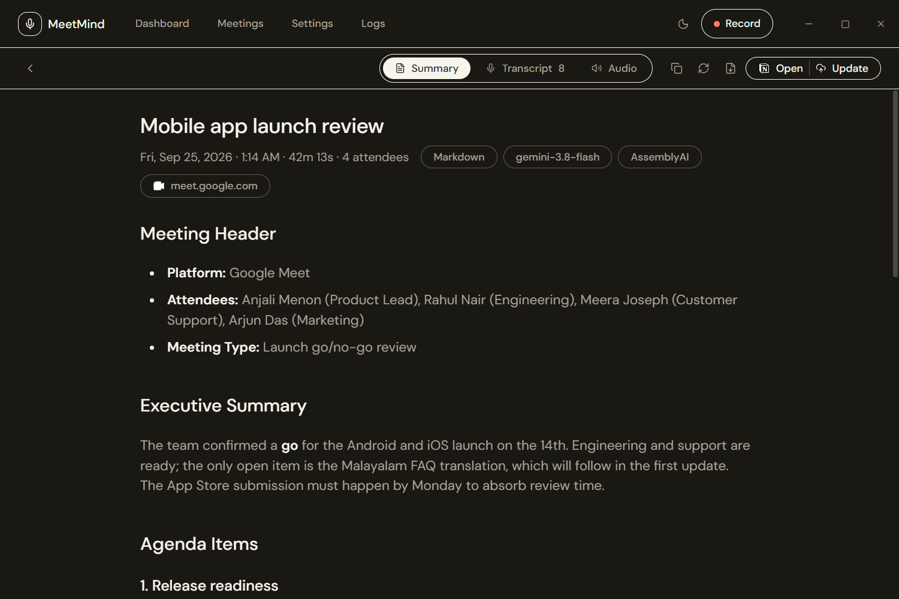
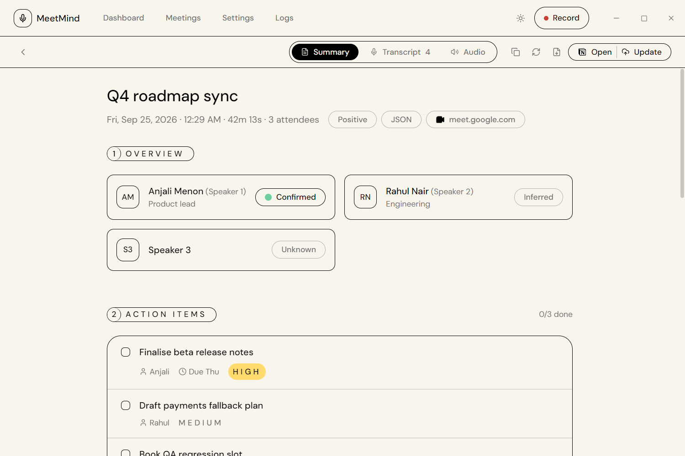

<div align="center">

<h1>
  <picture>
    <source media="(prefers-color-scheme: dark)" srcset="docs/brand/meetmind-wordmark-dark.png">
    
  </picture>
</h1>

<p><strong>Open-source AI meeting notes app for Windows.</strong><br>
Record Google Meet, Zoom or any call, transcribe it, summarize it with Gemini, and sync the minutes to Notion — no meeting bot joins your call.</p>

<p>
  <a href="https://github.com/aslahtp/meetmind/releases/latest"><strong>Download for Windows</strong></a> ·
  <a href="https://aslahtp.github.io/meetmind/">Website</a> ·
  <a href="#-features">Features</a> ·
  <a href="#-faq">FAQ</a> ·
  <a href="CHANGELOG.md">Changelog</a>
</p>

[](https://github.com/aslahtp/meetmind/actions/workflows/release.yml)
[](https://github.com/aslahtp/meetmind/releases/latest)
[](LICENSE)
[](https://github.com/aslahtp/meetmind)
[](https://www.electronjs.org/)
[](https://react.dev/)
[](https://vitejs.dev/)
[](https://tailwindcss.com/)
[](https://nodejs.org/)
[](https://ffmpeg.org/)
[](https://aistudio.google.com/)
[](https://www.assemblyai.com/)
[![Sarvam AI](https://img.shields.io/badge/Sarvam_AI-10b981?style=flat-square&logo=data:image/svg+xml;base64,PHN2ZyB4bWxucz0iaHR0cDovL3d3dy53My5vcmcvMjAwMC9zdmciIGZpbGw9Im5vbmUiIHZpZXdCb3g9IjAgMCAyNTMgMjUwIj48ZyBmaWxsPSIjZmZmIj48cGF0aCBkPSJtMjUyIDEwOS0xLTMtMTQtMTctMS0yLTEyLTEwLTEtMWgtMXYtMWwtMS0xNS0xLTItNy0yMi0xLTMtMS0xaC0xbC0zLTEtMTAtMy0xMS0yaC0yMGwtMTEtMTEtMi0xLTIyLTE0aC0ybC0zIDEtMjAgMTFoLTFsLTEgMS0xMyAxMS0xNS0xaC0zbC0yMyAzLTMgMS0xIDF2MWwtMiAyLTggMjEtMSAyLTMgMTctMTQgMTFMMiA5OWwtMSAyLTEgMXYxbDEgMyA3IDIyIDEgMnYxbDggMTMtNCAxNnYybC0xIDIzIDEgM3YxbDEgMSAyIDIgMTkgMTJoMWwxIDEgMTYgNSA3IDE1IDEgMiAxNSAxOCAyIDJ2MWg1bDEwLTEgMTEtMiAxLTFoMmwxNi02IDE1IDdoMmwyMiA1aDRsMS0xIDE3LTE3IDEtMSAxLTIgNS04di0xbDMtNXYtMWgybDE0LTQgMS0xaDFsMjAtMTEgMS0xIDItMXYtMmwxLTF2LTFsMS0yM3YtMmwtMi04LTEtN3YtMWwtMS0xaDF2LTFoMWw3LTExIDEtMSAxLTIgOC0yMXYtMmwxLTF6bS0zOC0yOHYybC0zIDE2djFsLTEgMy0yIDYtMTgtMTMtMS0xaC0xbC0yLTF2LTFsMS0zLTEtMjEgNyAyaDFsMyAxIDE0IDZ6bS0yNSA1NC01IDUgNCA5IDUgMTl2MWwtMSAxLTE5IDRoLTJsLTggMS0yIDctMSAyLTggMTctMSAyLTEtMS0xOC05LTEtMS03LTUtNiA0LTIgMS0xNyA4LTIgMXYtMWgtMWwtNy0xOHYtMmwtMi04aC02bC0zLTFoLTFsLTktMi05LTNoLTFsLTEtMXYtMmw2LTE4IDEtMSAxLTMgMi01LTQtNC0xLTEtMS0xLTYtOC01LTgtMS0yIDItMSAxNS05IDEtMSAyLTEgNi0zdi05bDItMTl2LTJoNGwxNyAyIDIgMSA4IDIgNC03aDF2LTFsMTQtMTMgMS0xIDIgMSAxMyAxNHYxbDEgMSA0IDYgNy0xIDEtMWgxcTExLTIgMjAtMWgxbDEgMnYyMWwtMSA3IDcgNCAyIDEgMTUgMTAgMSAxIDEgMS0xIDFxLTkgMTMtMTIgMTV6TTY3IDg4djRoLTJsLTIgMS0xIDEtMTYgMTAtMS02aC0xdi0zbC0yLTE2di0zbDMtMSAxNi02IDMtMSA0LTF6bTExNi01M2gybDIwIDR2MWw3IDE5djNsMSAydjZsLTEzLTUtMy0xLTExLTItMy05LTEtMy04LTE1em0tMTkgMSAxIDJoMWw4IDE1IDEgMyAyIDUtMjIgMmgtMmwtMSAxLTEtMi0xLTItMTQtMTUgNi0zaDFsMy0xdi0xbDE1LTR6bS01NS0xNiAxLTFoMWwxOC0xMGgxbDE4IDExIDEgMiA3IDYtMTMgNS0zIDEtMiAxLTggNC04LTUtMy0xaC0xbC0xNy03ek05NCAzNmwxLTJoM2wxNyA2djFoMmwxIDEgNCAyaC0xbC0xNSAxNXYxaC0xbC0xIDJoLTFsLTMtMS0xOS0zIDQtOXpNNDMgNTZsMS0yIDgtMTkgMjEtM2gxM2wtOCAxMy0yIDMtNCAxMGgtMWwtOSAyLTMgMS0xNyA2em0tMjYgNzF2LTFsLTEtMS02LTE5di0xbDEtMXE2LTkgMTMtMTVsMTAtOCAyIDE2IDEgNCAzIDEwdjFxMCAxIDAgMGwtNiA3LTEgMS0xIDItOSAxNXptMjQgNzAtMS0xaC0xbC0xOC0xMXYtMjJsMS0yIDItMTAgMTMgMTIgMSAxIDEgMSA4IDUgMSAxdjE0bDMgMTZ6bTE0LTU1LTYgMTktNS0zLTEtMS0xLTEtMTItMTEtMi0yIDEtMyA5LTE0IDEtMSAxLTIgMy00IDUgOCA3IDggMSAyIDEgMS0xIDN6bTYgNjEtMS0zLTMtMTZ2LTlsOCAyIDExIDNoNHYybDEgMnEzIDEwIDggMTlsLTYgMWgtNmwtMTMtMXptNDQgMzItMiAxaC0xbC0xMCAyLTEwIDFoLTFsLTEyLTE2LTEtMmgtMWwtNC05IDE4IDFoM2wxMC0yIDcgOSAxNCAxMnptMjItOS0zIDItMi0yLTEzLTEwLTItMi00LTYgMjAtOSAxLTEgMSAxaDFsMSAxIDE5IDEwLTMgNC0yIDEtMSAxem01Ni0xMC00IDctMSAyLTEgMS0xMyAxNGgtMXEtMTEgMC0yMC00aC0ybC05LTQgMTQtMTAgMS0yIDEtMSA3LTcgMTAgMmg0em0xMS0zM3Y0bC00IDE2LTEgM3YxaC0yMWwtMS0xLTgtMSA5LTE5IDEtMnYtMWgybDItMSAyMS00em0yLTM3LTItNCAxLTEgMi0xIDEzLTE3IDQgNCAxIDEgMSAzIDEgMSA3IDE0djFsMSAxdjFoLTFsLTEgMXYxbC0xMyAxMC0zIDItNiAzem0zMiA0NC0xOCAxMGgtMWwtMSAxLTggMiAzLTE1IDEtNHYtMTBsOS01IDMtMiAxMi05djFsMSA4djJ6bTE2LTc5LTggMjAtMSAxdjFsLTQgNy03LTEzdi0xbC0yLTItNy05IDQtOSAxLTN2LTFsMy0xNSA3IDYgMSAyIDEgMXoiLz48cGF0aCBmaWxsLXJ1bGU9ImV2ZW5vZGQiIGQ9Im0xMzUgMTM0LTkgNy04LTctNy05IDctOSA4LTcgOSA3IDcgOXoiIGNsaXAtcnVsZT0iZXZlbm9kZCIvPjwvZz48L3N2Zz4=)](https://dashboard.sarvam.ai/)
[](https://cloud.google.com/speech-to-text)
[](https://www.notion.so/)
[](https://developer.chrome.com/docs/extensions/)

</div>

## What is MeetMind?

**MeetMind is a free, open-source (MIT) desktop app for Windows 10 and 11 that turns online meetings into written meeting notes.** It records your computer's system audio and your microphone at the same time, sends the recording to the speech-to-text service you choose (**AssemblyAI**, **Google Cloud Speech-to-Text** or **Sarvam AI**), and uses **Google Gemini** to write a speaker-labelled summary with decisions and action items. Notes are stored locally in SQLite and can be exported to PDF, copied as Markdown or pushed to a **Notion** page. A companion **Chrome extension** adds a record button to Google Meet and Zoom so recording starts in one click.

Because MeetMind records audio on your own PC, nothing joins the meeting as a participant, and it works with any app that plays sound — Google Meet, Zoom, Microsoft Teams, Slack huddles, Discord, or a local recording file.

<p align="center">
  <picture>
    <source media="(prefers-color-scheme: dark)" srcset="docs/screenshots/dashboard-dark.png">
    
  </picture>
</p>

> [!TIP]
> **Can I use MeetMind for free?**
> Yes. The app is free and open source; you bring your own API keys. **Gemini** has a free tier that covers a moderate number of meetings per day, and **AssemblyAI's** $50 signup credit lasts a long time if you only use it for MeetMind.

## Contents

- [How it works](#-how-it-works)
- [Features](#-features)
- [Screenshots](#-screenshots)
- [Install](#-install)
- [Developer setup](#-developer-setup)
- [Building for production](#-building-for-production)
- [FAQ](#-faq)
- [Contributing](#-contributing)
- [License](#-license)

---

## 🧭 How it works

1. **Record.** Click the MeetMind button in Google Meet or Zoom, press **Record** in the app, or accept the reminder when a Google Calendar meeting starts. MeetMind captures system audio (WASAPI loopback) and your microphone together.
2. **Transcribe.** When you stop, the audio goes to your chosen speech-to-text engine, which returns a transcript with speaker labels (diarization).
3. **Summarize.** Gemini turns the transcript into meeting minutes — an executive summary, agenda, key decisions and an action items table with owners, deadlines and priorities — as Markdown or structured JSON.
4. **Share.** Read and search the notes in the app, export a PDF, copy Markdown, or sync a formatted page to Notion automatically.

---

## 🚀 Features

- **System audio + microphone recording**: records both sides of any call on Windows, with FFmpeg installed from inside the app.
- **Choice of speech-to-text**: AssemblyAI, Google Cloud Speech-to-Text (v1 and v2), or Sarvam AI, all with speaker diarization.
- **English–Malayalam code-switching**: accurate transcripts of mixed-language meetings with Sarvam AI's `saaras:v3` model.
- **AI meeting minutes with Gemini**: executive-style Markdown or structured JSON notes, an editable system prompt, and an automatic fallback model if the primary one fails.
- **Google Meet and Zoom extension**: a floating overlay in Chrome with one-click recording and live processing status.
- **Google Calendar integration**: see upcoming meetings on the dashboard and get a notification to start recording when one begins.
- **Notion sync**: notes become native Notion blocks (headings, tables, to-dos); re-syncing replaces the old page instead of duplicating it.
- **PDF and Markdown export**: save dated PDFs (optionally with the transcript) or copy the notes as Markdown.
- **Import existing audio or transcripts**: process WAV, MP3, M4A, MP4, WebM and other files, or paste a transcript to skip speech-to-text.
- **Local-first storage**: recordings, transcripts and notes stay in a local SQLite database; retries reuse the saved transcript instead of paying for transcription twice.
- **Searchable transcripts**: filter by speaker and search across every meeting.
- **Light and dark themes**, keyboard-accessible UI, and in-app updates from GitHub Releases.

---

## 📸 Screenshots


| Markdown meeting minutes | Decisions & action items |
| :---: | :---: |
|  |  |
| Executive-style minutes in Markdown: meeting header, summary and agenda | Numbered decisions and an action items table with owner, deadline and status |
| **Transcript** | **Output format** |
|  |  |
| Speaker-labelled transcript you can search and filter by speaker | Choose Markdown minutes or structured JSON notes, and edit the system prompt |
| **Dark theme** | **JSON notes** |
|  |  |
| Full dark theme built from the same design tokens | The structured alternative: identified speakers and prioritised action items |


---

## 📦 Install

### Windows app

1. Download `MeetMind-Setup-x.y.z.exe` from the [latest GitHub release](https://github.com/aslahtp/meetmind/releases/latest) and run it.
2. Open MeetMind → **Settings → Transcription** and pick a speech-to-text engine:
   - **AssemblyAI** (recommended): paste your AssemblyAI API key.
   - **Google Cloud Speech-to-Text**: enter your Google Cloud API key and project ID (see [GCS setup](docs/GCS-SETUP.md) for long recordings).
   - **Sarvam AI**: paste your Sarvam AI API key (best for English–Malayalam meetings).
3. In **Settings → Notes**, add your **Gemini API key** ([get one from Google AI Studio](https://aistudio.google.com/app/apikey)).
4. In **Settings → System**, click **Download & Install FFmpeg** if it is not already installed.
5. Optional: in **Settings → Integrations**, connect **Notion** and **Google Calendar**.

Every API key field in Settings has a "How to get a key" guide next to it.

### Chrome extension (Google Meet and Zoom)

1. Download and extract `meetmind-extension.zip` from the [latest release](https://github.com/aslahtp/meetmind/releases/latest).
2. Open Chrome and go to `chrome://extensions`.
3. Turn on **Developer mode** (top right).
4. Click **Load unpacked** and select the extracted folder.

The extension only talks to the MeetMind desktop app over a local WebSocket (`127.0.0.1`); keep the app running while you use it.

---

## 💻 Developer setup

Requires Windows, Node.js 22.12+ and [pnpm](https://pnpm.io/).

### 1. Clone and install

```bash
git clone https://github.com/aslahtp/meetmind.git
cd meetmind
pnpm install
```

### 2. FFmpeg

Let the app install FFmpeg for you (**Settings → System → Download & Install FFmpeg**), or download the essentials build from [gyan.dev/ffmpeg/builds](https://www.gyan.dev/ffmpeg/builds/) and place the executables in:

```bash
assets/ffmpeg/ffmpeg.exe
assets/ffmpeg/ffprobe.exe
```

### 3. Run

```bash
pnpm run dev
```

This packages the extension, starts the Vite dev server and launches Electron with DevTools open.

### 4. Chrome extension

Open `chrome://extensions`, enable **Developer mode**, click **Load unpacked** and select the `extension/` folder in this repository.

### 5. API keys

On first run, open **Settings** and add:

- **Speech-to-text**: an AssemblyAI, Google Cloud or Sarvam AI API key.
- **Notes**: a Gemini API key ([get it here](https://aistudio.google.com/app/apikey)).
- **Notion** (optional): an integration token and a parent page or database ID.

See [AGENTS.md](AGENTS.md) for an architecture overview of the main process, renderer, processing pipeline and extension bridge.

---

## 🚢 Building for production

Place `ffmpeg.exe`, `ffprobe.exe` and `icon.ico` in `assets/` first, then run:

```bash
pnpm run build
```

This produces the Windows installer (`dist/desktop/MeetMind-Setup-X.Y.Z.exe`) and the Chrome extension zip (`dist/meetmind-extension.zip`).

> [!CAUTION]
> Never commit downloaded FFmpeg `.exe` files, as they exceed GitHub's 100MB file size limit.

---

## ❓ FAQ

### Is MeetMind free?

Yes. MeetMind is free and open source under the MIT license. You pay only for the AI services you connect, and both Gemini (free tier) and AssemblyAI (signup credit) can be used at no cost for moderate use.

### Does a bot join my meeting?

No. MeetMind records the audio playing on your own computer plus your microphone, so no extra participant appears in Google Meet, Zoom or Teams.

### Which meeting apps does it work with?

Any app that plays audio on Windows: Google Meet, Zoom, Microsoft Teams, Slack, Discord, Webex and others. The Chrome extension adds a one-click record button specifically for Google Meet and Zoom in the browser.

### Does MeetMind work on macOS or Linux?

Not currently. MeetMind is built for Windows 10 and 11 because it relies on Windows audio loopback capture.

### Where is my data stored? Is it private?

Recordings, transcripts and notes are stored locally on your PC. There is no MeetMind server or account: audio is sent only to the speech-to-text provider you choose, and the transcript only to Gemini, using your own API keys. Notion sync is optional.

### Which languages are supported?

Language support depends on the speech-to-text engine you choose. For meetings that mix English and Malayalam, use Sarvam AI's `saaras:v3` model, which handles code-switching within a sentence.

### How is MeetMind different from Otter.ai or Fireflies.ai?

Hosted note takers such as Otter.ai and Fireflies.ai are subscription services that typically join calls as a bot and keep recordings on their servers. MeetMind is an open-source desktop app: it records locally without a bot, lets you choose the transcription provider, stores notes on your machine, and costs nothing beyond your own API usage.

### Can I get notes for a recording I already have?

Yes. Use **Import audio** on the dashboard to process an existing WAV, MP3, M4A, MP4, WebM or similar file, or **Paste transcript** to generate notes from text you already have.

### Do I need Notion?

No. Notion sync is optional. Notes are always available in the app and can be exported as PDF or copied as Markdown.

---

## 🤝 Contributing

Bug reports, feature ideas and pull requests are welcome. Read [CONTRIBUTING.md](CONTRIBUTING.md) to get started, and report security issues privately as described in [SECURITY.md](SECURITY.md).

If MeetMind is useful to you, consider giving the repository a ⭐ so others can find it.

---

## 📄 License

[MIT](LICENSE) © 2026 Aslah
