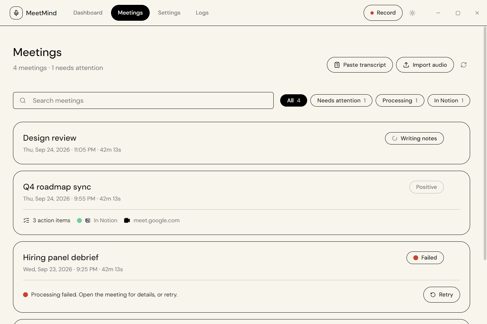
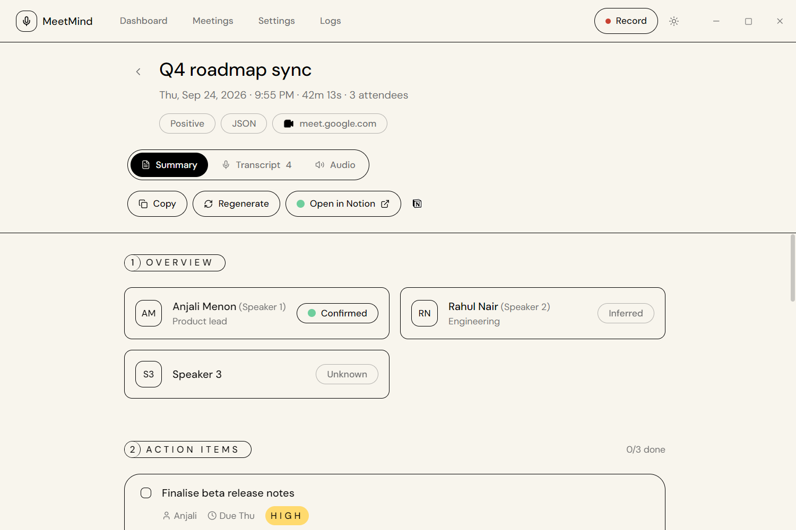
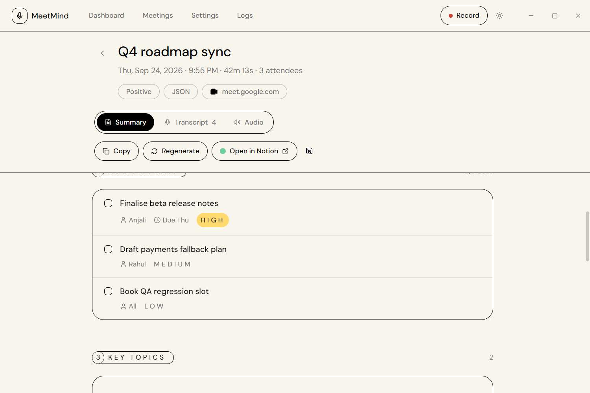
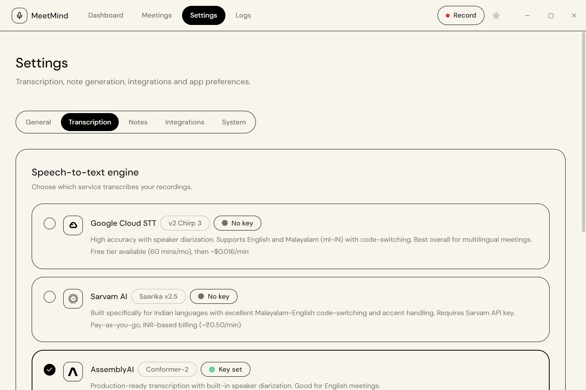
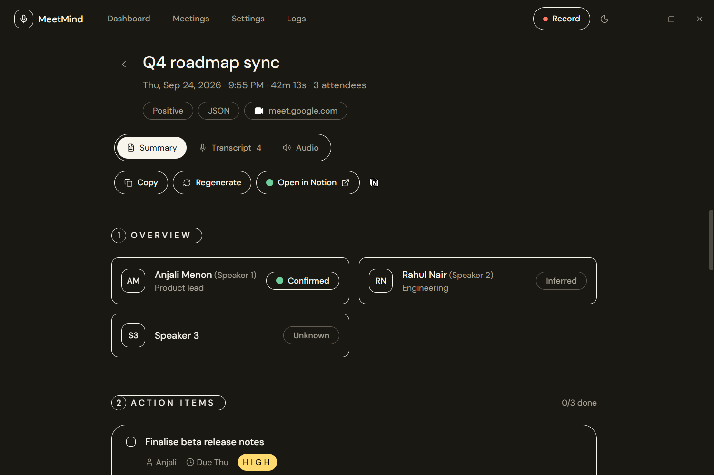

<div align="center">

AI-powered meeting notes for Windows. Records system audio + microphone, transcribes with **Google Speech-to-Text (v1/v2)**, **AssemblyAI**, or **Sarvam AI**, generates structured notes or executive-grade Markdown with Gemini, and uploads to Notion — automatically triggered from Google Meet or Zoom via a Chrome extension.

<picture>
  <source media="(prefers-color-scheme: dark)" srcset="docs/screenshots/dashboard-dark.png">
  
</picture>

> [!TIP]
> **How to use this for free?**
> You can run MeetMind entirely for free! **Gemini** has a generous free tier which is more than enough for a moderate amount of meetings per day. For transcription, **AssemblyAI's** $50 signup credits will likely be enough for a lifetime if only used for MeetMind.

---

## 🚀 Features

- **Dual Audio Capture**: Seamlessly records system audio (WASAPI loopback) and microphone simultaneously.
- **Advanced Transcription & Diarization**: Supports Google STT, AssemblyAI, or Sarvam AI with built-in speaker labels.
- **Bilingual Code-Switching**: Full transcription and AI support for mixed English & Malayalam meetings using Sarvam AI's saaras:v3 model.
- **Smart Note Generation**: Choose between structured JSON notes or executive-grade Markdown (Executive Summary, Action Items, Decisions, etc.) powered by Gemini.
- **Native Notion Sync**: Converts generated notes directly into native Notion page blocks with rich formatting.
- **Seamless Chrome Extension**: Floating overlay in Google Meet and Zoom with one-click recording and real-time status updates.
- **Smart Retries & Caching**: SQLite-backed local storage reuses cached transcripts on processing retries to eliminate duplicate API calls.

---

## 📸 Screenshots

| Meetings | Meeting notes |
| :---: | :---: |
|  |  |
| Search and filter every recording, with live processing status | Speakers identified by name, with a confidence label on each |
| **Action items** | **Transcript** |
|  |  |
| Action items with owner, due date and priority | Speaker-labelled transcript you can search and filter by speaker |
| **Settings** | **Dark theme** |
|  |  |
| Pick a speech-to-text engine and add keys in tabbed settings | Full dark theme built from the same design tokens |

---

## 📦 Setup & Installation

### Windows App

1. Download and install `MeetMind Setup x.y.z.exe` from the [Latest GitHub Release](https://github.com/aslahtp/meetmind/releases/latest).
2. Open MeetMind → **Settings → API Keys**.
3. Configure your **Transcription Service**:
   - **AssemblyAI** (Recommended): Paste your AssemblyAI API key.
   - **Google STT**: Enter your Google Cloud API key and Project ID.
   - **Sarvam AI STT**: Paste your Sarvam AI API key.
4. Add your **Gemini API Key** ([Get it from Google AI Studio](https://aistudio.google.com/app/apikey)).
5. Under **System Dependencies**, click **Download & Install FFmpeg** if it is not already installed.
6. Configure **Audio Devices** (System Audio + Microphone) and run a quick test recording.

### Browser Extension

1. Download and extract `meetmind-extension.zip` from the [Latest Release](https://github.com/aslahtp/meetmind/releases/latest).
2. Open Chrome and navigate to `chrome://extensions`.
3. Enable **Developer Mode** (top right toggle).
4. Click **Load unpacked** and select the extracted extension folder.

---

## 🛠️ Quick Start (Developer Setup)

### 1. Clone & Install

```bash
pnpm install
```

### 2. FFmpeg Setup

You can let the app install FFmpeg automatically by running it and clicking **Download & Install FFmpeg** under Settings → System Dependencies.

Alternatively, for manual setup, download FFmpeg from [gyan.dev/ffmpeg/builds](https://www.gyan.dev/ffmpeg/builds/) (essentials build) and place the executables in:

```bash
assets/ffmpeg/ffmpeg.exe
assets/ffmpeg/ffprobe.exe
```

### 3. Run Application

```bash
pnpm run dev
```

This will automatically package the extension, start the Vite server, and launch Electron.

### 4. Chrome Extension

1. Open Chrome and navigate to `chrome://extensions`
2. Enable **Developer Mode** (top right).
3. Click **Load unpacked** and select the `extension/` folder in this repository.

### 5. API Configuration

On your first run, head over to the **Settings** screen in MeetMind and provide your preferred API keys:

- **Speech-to-Text**: AssemblyAI, Google Cloud, or Sarvam AI API Key.
- **LLM**: Gemini API Key ([Get it here](https://aistudio.google.com/app/apikey)).
- **Notion** (Optional): Integration Token & parent Page/Database ID.

---

## 🏗️ Building for Production

To compile MeetMind for Windows, ensure `ffmpeg.exe` and `icon.ico` are placed in the `assets/` directory.

```bash
pnpm run build
```

This will generate the Windows executable (`dist/desktop/MeetMind Setup X.Y.Z.exe`) and the Chrome extension zip (`dist/meetmind-extension.zip`).

> [!CAUTION]
> Never commit downloaded FFmpeg `.exe` files, as they exceed GitHub's 100MB file size limit.

---

## 📄 License

MIT
